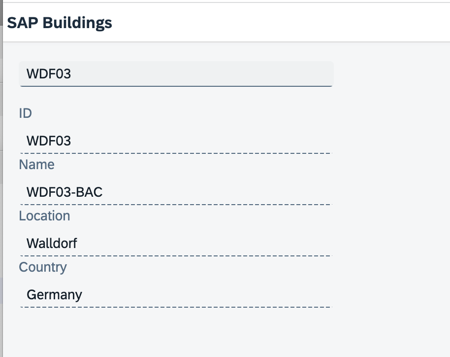

# Exercise 1 - Cloning the start project

In this exercise you'll clone a simple UI5 example application which will be enhanced with ValueHelp capabilities in this workshop.

## Scenario

We have to create a part of a facility management application, where the user can select a building out of a list of buildings of a company, located around the world. The properties of the selected building are displayed. 
The first version requires that the user enters a valid buidling id in the input field. The id consists of a three character code for the location and a two digit number. Valid ids are ROT03, WDF01, WDF03, WDF49, BLR08, CPH01 and so on. Since hardly anybody can remember all the location codes, we need a reasonable ValueHelp for that input field. 

## Prerequisites

You need **node.js** (e.g. the latest stable LTS version), **git** and you need the **SAP UI5 runtime tools** which can be installed globally on your machine with **npm**
```
npm install --global @ui5/cli
```

## Exercise 1.1 - Clone the template project

After completing these steps you have the start project which we will enhance with a value help.

1. Clone the project.
```
git clone https://github.com/dirkelko/ui5comWorkshop.git
```
2. Open it with your development environment (e.g. Visual Studio Code) and go to the **template/vhfacilities** folder.
3. Open a terminal in this folder.
4. In order to launch the app, simply run the following from the app root folder:
```
    npm install
```
```
    ui5 serve
```
The application will now run at http://localhost:8080

<br><br><br><br>

5. Enter different building IDs for example WDF01, WDF13, ROT24, SOF02 into the input field.

## Summary

You've successfully accomplished [Exercise 1 - Cloning the template project](#exercise-1---cloning-the-template-project)!

Continue to [Exercise 2 - Adding type ahead functionality](../ex2/README.md).