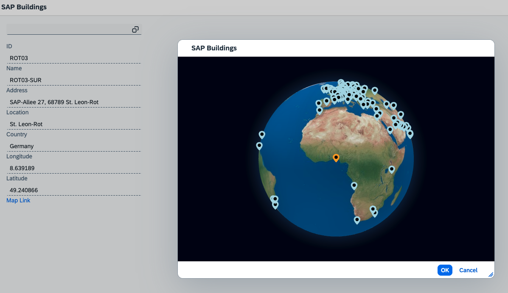

# Exercise 8 - Implementing custom content for the value help dialog

In this exercise we'll enhance our application with a brand new data-visualization based on https://globe.gl/.


## Exercise 8.1 - Enhance your projects capabilities

In this step we want to add the functionality to access node modules and being able to serve static files to our project.

##### Install the following NPM dependencies:

```shell
npm i -D ui5-tooling-modules ui5-middleware-servestatic
```

***vhfacilities/package.json***

```json
"devDependencies": {
   ...
},
"ui5": {
    "dependencies": [
      "ui5-middleware-livereload",
      "ui5-tooling-modules",
      "ui5-middleware-servestatic"
    ]
},
```
***vhfacilities/ui5.yaml***

```yaml
...
builder:
  customTasks:
    - name: ui5-tooling-modules-task
      afterTask: replaceVersion
...
server:
  customMiddleware:
  - name: ui5-middleware-livereload
    afterMiddleware: compression
    configuration:
      debug: true
      extraExts: "xml,json,properties"
      port: 35729
      path: "webapp"
  - name: ui5-tooling-modules-middleware
    afterMiddleware: compression
  - name: ui5-middleware-servestatic
    afterMiddleware: compression
    mountPath: /assets
    configuration:
      rootPath: "/assets"
```


## Exercise 8.2 - We create our new visualization
##### Add the awesome globe.gl package to the project:

```shell
npm i -S globe.gl
```
##### Download [this asset](./vhfacilities/webapp/assets/earth-day.jpg) which we want to serve statically and place it in /vhfacilities/webapp/assets/

#### Create a basic Globe Control

With these new dependencies in place, we can now create a basic control rendering a 3d globe with html markers. Additionally, we use ResizeObserver to keep the globe's size in sync with the available space and add some basic animations.

***vhfacilities/webapp/controls/Globe.js***

```javascript
sap.ui.define([
	'sap/ui/core/Control',
	'globe.gl'
],
	function(Control, GlobeGL) {
		"use strict";

		// We start from a basic control rendering a div claiming 100% width and height
		var Globe = Control.extend("ui5con.vhdemo.controls.Globe", {
			metadata: {
				properties: {
					htmlElements: {
						type: "object[]",
						defaultValue: [],
					}
				},
				events: {
					htmlElementClick: {}
				}
			},
			renderer: {
				apiVersion: 2,
				render: function(oRm, oControl) {
					oRm.openStart("div", oControl);
					oRm.class("Globe");
					oRm.style("width","100%");
					oRm.style("height","100%");
					oRm.openEnd();
					oRm.close("div");
				}
			}
		});

		// Whenever this control is rendered, we use globe.gl to also render a 3d globe to our div
		// We also observe size changes of our div to keep the globe's size in sync
		Globe.prototype.onAfterRendering = function () {
			var oDomRef = this.getDomRef();
			var oBoundaries = oDomRef.getBoundingClientRect();
			var aHtmlElements = this.getHtmlElements();
			
			this._o3DGlobe = GlobeGL()
				.width(oBoundaries.width)
				.height(oBoundaries.height)
				.globeImageUrl('/assets/earth-day.jpg')
				.htmlElementsData(aHtmlElements)
				.htmlElement(d => {
				const el = document.createElement('div');
				el.innerHTML = `<svg class="Globe--marker" viewBox="-4 0 36 36">
					<path class="Globe--marker--outer" fill="currentColor" d="M14,0 C21.732,0 28,5.641 28,12.6 C28,23.963 14,36 14,36 C14,36 0,24.064 0,12.6 C0,5.641 6.268,0 14,0 Z"></path>
					<circle class="Globe--marker--inner" fill="black" cx="14" cy="14" r="7"></circle>
					<title>${d.context.name}: ${d.context.street}, ${d.context.zip} ${d.context.city} ${d.context.countryId}</title>
				</svg>`;
				el.style.color = d.color;
				el.style.width = `${d.size}px`;

				el.style['pointer-events'] = 'auto';
				el.style.cursor = 'pointer';
				el.onclick = function (oEvent) {
					this.fireEvent("htmlElementClick", {htmlElement: d, globeEvent: oEvent});
					this._focusHtmlElement(d);
				}.bind(this);
				return el;
				})
				(oDomRef);

			var oFirstSelectedEl = aHtmlElements.find(d => d.color === 'orange');
			this._focusHtmlElement(oFirstSelectedEl);

			this._oResizeObserver = this._oResizeObserver || new ResizeObserver(function (aEntries) {
				this._o3DGlobe.width(aEntries[0].contentRect.width)
				this._o3DGlobe.height(aEntries[0].contentRect.height)
			}.bind(this));
			this._oResizeObserver.observe(oDomRef);
		};

		// We want to focus some elements via globe.gl's pointOfView method
		Globe.prototype._focusHtmlElement = function (oElement) {
			this._o3DGlobe.pointOfView({lat: oElement && oElement.lat || 0 , lng: oElement && oElement.lng || 0, altitude: 2}, 750);
		};	

		// We push htmlElement changes also to our _o3DGlobe control to keep it in sync
		Globe.prototype.setHtmlElements = function (aValues) {
			this.setProperty("htmlElements", aValues, true);
			
			if (this._o3DGlobe) {
				this._o3DGlobe.htmlElementsData(aValues);
			}
		};	

		// We do some cleanup
		Globe.prototype.exit = function() {
			if (this._oResizeObserver) {
				this._oResizeObserver.disconnect()
				this._oResizeObserver = null;
			}
			Control.prototype.exit.apply(this, arguments);	
			this._o3DGlobe = null;
		};
	
		return Globe;
	});
```

## Exercise 8.3 - Create a ValueHelp content wrapper

This control will be the bridge between the ValueHelp and our new Globe control.
It manages the content to be displayed and handles data updates in both directions (ValueHelp to Globe and vice versa)

***vhfacilities//webapp/controls/valuehelp/GlobeContent.js***


```javascript
sap.ui.define([
	'sap/ui/mdc/valuehelp/base/Content',
	'sap/ui/mdc/enum/SelectType',
	'sap/base/util/restricted/_debounce',
	'../Globe'
],
	function(Content, SelectType, debounce, Globe) {
		"use strict";

		// Starting from a valuehelp/base/Content ...
		var GlobeContent = Content.extend("ui5con.vhdemo.controls.valuehelp.GlobeContent", {
			metadata: {
				properties: {
					htmlElements: {
						type: "object[]",
						defaultValue: [],
						bindable: true
					},
				}
			}
		});

		// ... we create our Globe display content with a click listener which creates or removes valuehelp conditions via an event
		GlobeContent.prototype.init = function () {
			Content.prototype.init.apply(this, arguments);
			
			this._oGlobeControl = new Globe({
				htmlElementClick: function (oEvent) {
					var oContext = oEvent.mParameters.htmlElement.context
					var oCondition = this.createCondition(oContext.id, oContext.name);
					var bSelected = this._isContextSelected(oContext);
					this.fireSelect({ type: bSelected ? SelectType.Remove : SelectType.Add, conditions: [oCondition] });
				}.bind(this)
			});
			this.setAggregation("displayContent", this._oGlobeControl);
		}

		// We update the globe's markers whenever htmlElements or ...
		GlobeContent.prototype.setHtmlElements = function(aValues) {
			this.setProperty("htmlElements", aValues, true)
			this._oGlobeControl.setHtmlElements(this._getHTMLElementsWithState());
		};

		// ... conditions are updated
		GlobeContent.prototype.handleConditionsUpdate = function () {
			this._oGlobeControl.setHtmlElements(this._getHTMLElementsWithState());
		};

		// We change marker colors depending on the contexts selection state
		GlobeContent.prototype._getHTMLElementsWithState = function () {
			return this.getHtmlElements().map(function (oElement) {
				return Object.assign({}, oElement, {size: oElement.size || 20, color: (this._isContextSelected(oElement.context) ? "orange" : (oElement.color || "lightblue"))})
			}.bind(this));
		};

		// We determine the selection state for contexts by comparing their id attribute with condition values
		GlobeContent.prototype._isContextSelected = function(oContext) {
			var aSelectedValues = this.getConditions().map(function(oCondition) { return oCondition.values[0]; });
			return aSelectedValues.indexOf(oContext.id) >= 0;
		};

		// We do some cleanup
		GlobeContent.prototype.exit = function () {
			this._oGlobeControl = null;
			Content.prototype.exit.apply(this, arguments);
		};
		
		return GlobeContent;
	});
```

## Exercise 8.4 - Piece everything together

In this step, we connect our data to the new controls via a small formatter 

***vhfacilities/webapp/controller/Building.controller.js***

```javascript
onGetAddress: function (buildingId) {
  ...
},
...
formatFacilityAsHTMLMarker: function (aFacilityContexts) {
  return aFacilityContexts.map(function (oFacility) {
    return {
      lat: oFacility.geoLocation.latitude,
      lng: oFacility.geoLocation.longitude,
      context: oFacility
    };
  }) 
}
```
***vhfacilities/webapp/view/Building.view.xml***


```xml
  <mvc:View controllerName="ui5con.vhdemo.controller.Building" ... xmlns:cvh="ui5con.vhdemo.controls.valuehelp">
  ...
  <mdc:dialog>
    <mdcv:Dialog>
      <cvh:GlobeContent htmlElements="{path: 'facilities>/buildings', formatter: '.formatFacilityAsHTMLMarker'}"/>
    </mdcv:Dialog>
  </mdc:dialog>
</mdc:ValueHelp>
```
## Exercise 8.5 - Check the results


If everything went as planned, you should now be able to see your new visualization, when opening the ValueHelp dialog. Clicking a marker should color it orange and pressing 'OK' right after should change the value in the Field accordingly.


